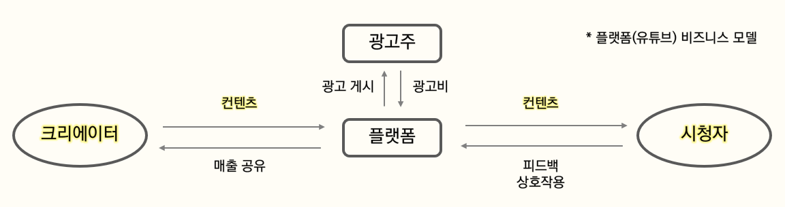
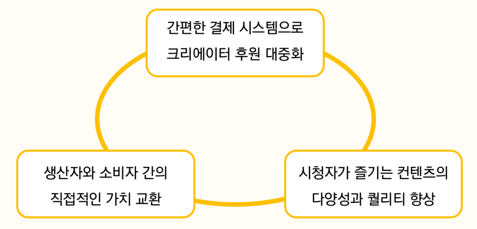
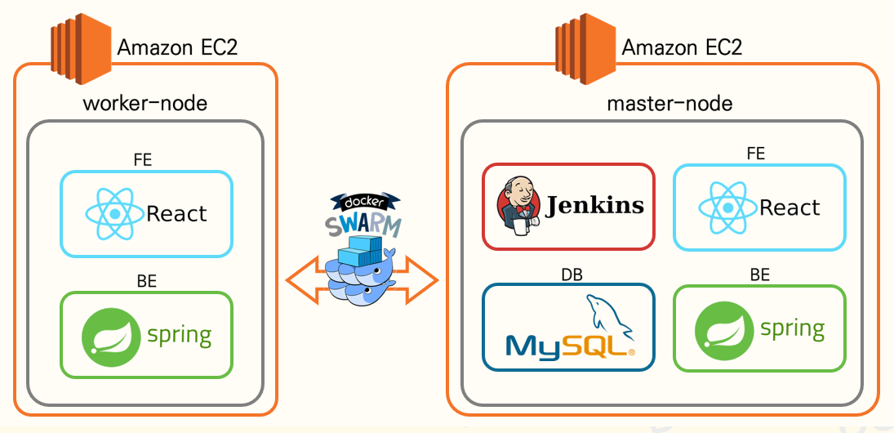
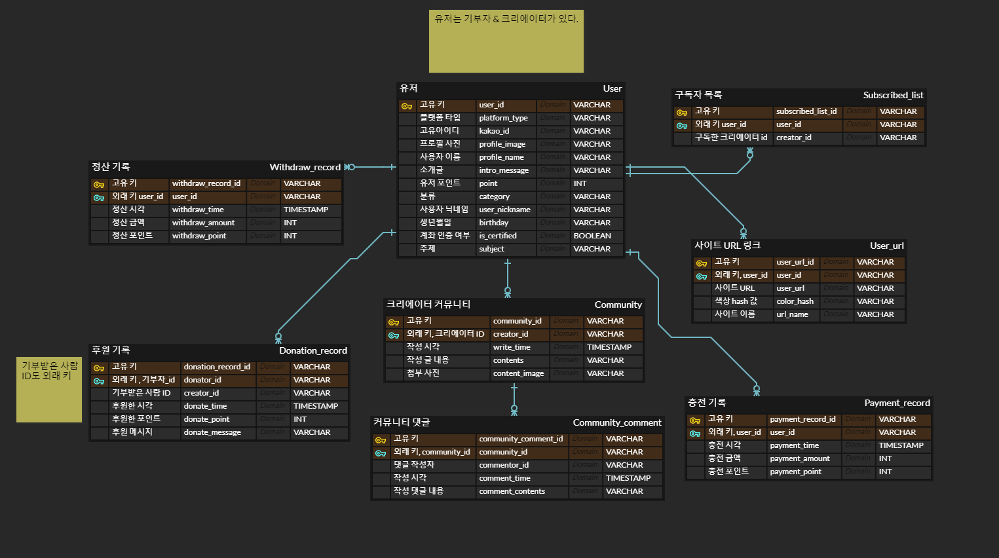

# Do!nation

## ✅ 프로젝트 소개

**창작자와 팬들이 서로 소통하고 쉽고 빠르게 도네이션 할 수 있는 서비스**

- 기획 배경

  - 문제의식

    - 미디어의 발전에 따른 컨텐츠의 변화, 컨텐츠 소비자들의 취향 다변화

    - 수많은 크리에이터들이 다양한 플랫폼에서 활동하고 있음

      

    - 생태계의 핵심은 생산되고 소비되는 컨텐츠 그 자체

    - 그러나 크리에이터와 소비자 간 가치의 전달은 제한적

  - 응원하는 크리에이터에게 플랫폼과 상관 없이 간편하게 후원할 수 있는 서비스의 필요성

    - DO!Nation

- 기대 효과

  - ‘후원 문화의 대중화’, ‘컨텐츠의 양과 질 향상’, ‘생태계 기여자들 간의 가치 교환 활성화’의 선순환을 통한 미디어 플랫폼 생태계의 발전

    


## ✅ 주요 기능

## 1. Donation

- 후원
- 응원 메시지

## 2. Profile

- 팬 커뮤니티
- 소셜 로그인
- 프로필 검색

## 3. Payment

- 카카오페이
- 포인트 충전

## 4. Withdraw

- 계좌인증
- 포인트 현금 정산 및 출금


## ✅ 서비스 아키텍쳐




## ✅ ERD




## ✅ 개발 환경

| Backend         | Frontend                | CI/CD     | 컨테이너 오케스트레이션 |
| --------------- | ----------------------- | --------- | ----------------------- |
| IntelliJ        | VS code                 |           | Docker-swarm            |
| spring boot     | React 17.0.2            | Docker    |                         |
| Spring Security | React Bootstrap 2.2.1   | nginx     |                         |
| Java 11         | React-Router-Dom 6.2.2  | Jenkins   |                         |
| MySQL           | Styled-Components 5.3.3 | sonarqube |                         |
| Swagger         |                         |           |                         |

### Backend

- 


### Frontend

- axios로 DB와 데이터 통신

  - api instance를 따로 관리하여 주소가 변하더라도 전체 적용될 수 있도록 제작

- styled component 사용으로 직접 컴포넌트 디자인

  - 미디어 쿼리의 screen 속성을 사용하여 화면 크기에 따라 컴포넌트의 크기와 배치에 변화를 주어 반응형 웹 제작
  - :hover 와 같은 CSS 의사 클래스를 사용하여 특별한 조건에서 발동하는 스타일 적용

- react hook 사용하여 동기적 작업 수행

  - useState를 사용하여 컴포넌트 내에서 상태 관리, 컴포넌트 간 상태 관리는 props를 활용
  - useEffect를 통해 컴포넌트가 렌더링 돼었을 때 최초 한 번만 DB로 부터 정보를 받아오고, 두 번째 인자를 활용하여 해당 상태가 변경되었을 때 함수 호출

- react-router-dom를 사용하여 SSR 수행

  - 최상위 컴포넌트에서 여러 개의 컴포넌트를 단계별로 정의하기 위해 중첩 라우팅을 사용
  - Outlet 라이브러리를 통해 중첩 라우팅의 자식 태그로 기재된 컴포넌트를 불러옴

- redux를 사용하여 회원정보 관리

  - 로그인 시, redux에 회원정보를 저장하여 새로고침을 하였을 때에도 기존 회원정보를 지속적으로 갱신할 수 있도록 설계

  

### 배포

- 


## ✅ 협업 툴

### Branch 명

{f or b}/{type}/{issue number}-{간단한 이슈 설명}

- frontend

  ```jsx
  f/feat/12-create-function
  ```

- backend

  ```jsx
  b/fix/hot fix
  ```

  

### Git commit 메시지

{f or b}/{type}: {설명}

1. Git commit rule

   | FEAT             | 새로운 기능을 추가할 경우                                    |
   | ---------------- | ------------------------------------------------------------ |
   | FIX              | 버그를 고친 경우                                             |
   | DESIGN           | CSS 등 사용자 UI 디자인 변경                                 |
   | STYLE            | 코드 포맷 변경, 간단한 수정, 코드 변경이 없는 경우           |
   | !BREAKING CHANGE | 커다란 API 변경의 경우                                       |
   | !HOTFIX          | 급하게 치명적인 버그를 고쳐야하는 경우                       |
   | STYLE            | 코드 포맷 변경, 세미 콜론 누락, 코드 수정이 없는 경우        |
   | REFACTOR         | 프로덕션 코드 리팩토링                                       |
   | COMMENT          | 필요한 주석 추가 및 변경                                     |
   | DOCS             | 문서를 수정한 경우                                           |
   | TEST             | 테스트 추가, 테스트 리팩토링(프로덕션 코드 변경 X)           |
   | CHORE            | 빌드 태스트 업데이트, 패키지 매니저를 설정하는 경우(프로덕션 코드 변경 X) |
   | RENAME           | 파일 혹은 폴더명을 수정하거나 옮기는 작업만인 경우           |
   | REMOVE           | 파일을 삭제하는 작업만 수행한 경우                           |

   ```
   ex) f/feat : Login 기능 추가
   ```

   

### Jira

- 스프린트 : 주차 별로 스프린트 생성 ex) Week1, Week2 ...
- 에픽 : 기능별 생성
- 스토리 : 본인 작업 알아서 적기
- 태스크 : 문서 작업 / 기타 작업


### Swagger

- Swagger를 통해서 API 문서 자동화
- Swagger URL : http://k6c101.p.ssafy.io:8080/swagger-ui/


## ✅ 배포 환경 및 포트 정리

- **URL** : http://k6c101.p.ssafy.io/

- **배포 여부** : O

- **접속 가능** : 접속 가능

- **사용 포트**

  | 3000 | React                       |
  | ---- | --------------------------- |
  | 8080 | server                      |
  | 8000 | Jenkins                     |
  | 9000 | sonarqube                   |
  | 3300 | MysqlAdmin                  |
  | 3306 | Mysql                       |
  |      | server default(nginx, http) |